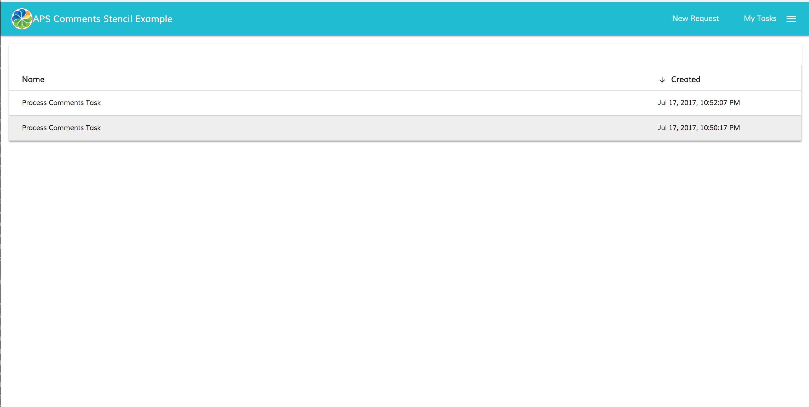
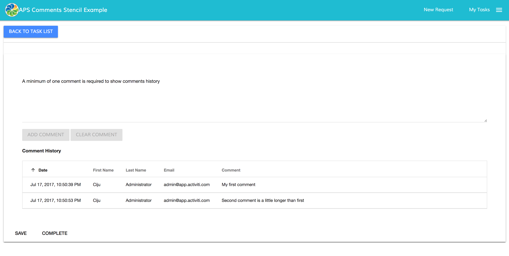

# Creating aps-comments-stencil-sample (ADF 1.6.1 example)

This project is part of the [Alfresco Application Developer Framework](https://github.com/Alfresco/alfresco-ng2-components) collection of examples.
For further details about the repository and all the available examples please check the [introduction](https://github.com/Alfresco/adf-examples).

## About this project

This project implements an [Alfresco ADF](https://github.com/Alfresco/alfresco-ng2-components) application, starting process instances and viewing open tasks. Very specifically this example shows how to implement the comments feature in APS as a form component/stencil in an ADF application.

By its nature, the application interacts with Alfresco Process Services as BPM System.

## Prerequisites

Before running the application, please check the assumptions listed below.

- Alfresco Process Services v1.6.0+ running on `localhost` on port `9999`. You can check [here](https://community.alfresco.com/docs/DOC-6614-installing-activiti-bpm-as-adf-service-layer) for further details on how to install and setup Alfresco Activiti as Alfresco ADF Service Layer. If you have Alfresco Process Services running on a port other than 9999, don't worry, there is a settings option using which you can change the url before logging into the web application. Alternatively change the url in app.config-prod.json file

- [Node.js](https://nodejs.org) JavaScript runtime version 6.9+. Together with its package ecosystem named [npm](https://www.npmjs.com/).


## Running the application

Once the prerequisites will be checked, follow the tasks below to run the application.

- Open a terminal and change the directory to be in the `aps-comments-stencil-sample` folder.

- Install dependencies executing the command below. The execution of this command will require some time to be completed. If some warnings will appear into the terminal, don't worry.

```sh
npm install
```

- Compile and run the application executing the command below. The command compiles and starts the project in watch mode. Upon start, you can navigate to `http://localhost:3000` with your preferred browser. The browser will automatically reload upon changes to the source code.

```sh
npm start
```

- Log into the application using your Alfresco Process Services credentials and you should see any open tasks via "My Tasks" component. You should now also be able to start any processes that you have access via "Start New Process" tab/link in the ADF application.

- **Let's now test the comments component. In order to do that that please import a sample process application named "ProcessComments.zip" present in this directory into your Alfresco Process Services and publish the application using the Alfresco Process Services UI. This step will deploy a process where a custom "processcomments" form stencil component is defined on both start and task forms. Run the newly deployed process via this ADF app which will render the comments component correctly in the ADF app.**

## Screenshots

Below some screenshots of the application as an example.





## Feedback, issues or support

For feedback, issues or simply to request support, check the introduction [introduction](https://github.com/Alfresco/adf-examples) for further details.

## Disclaimer

All the content available in this tutorial has been developed and tested using Alfresco ADF v1.6.1 LA release, NodeJs 8.0.0 on a MacOS.
Each variation to the listed versions and tools could affect the success of the execution, even if the involved technologies and tasks have been defined to be as more general as possible, not related to any specific context or platform.

## License

Copyright (C) 2017 Alfresco Software Limited

Alfresco Software Limited licenses this file to you under the Apache License, Version 2.0 (the "License"); you may not use this file except in compliance with the License. You may obtain a copy of the License at

 http://www.apache.org/licenses/LICENSE-2.0

Unless required by applicable law or agreed to in writing, software distributed under the License is distributed on an "AS IS" BASIS, WITHOUT WARRANTIES OR CONDITIONS OF ANY KIND, either express or implied. See the License for the specific language governing permissions and limitations under the License.