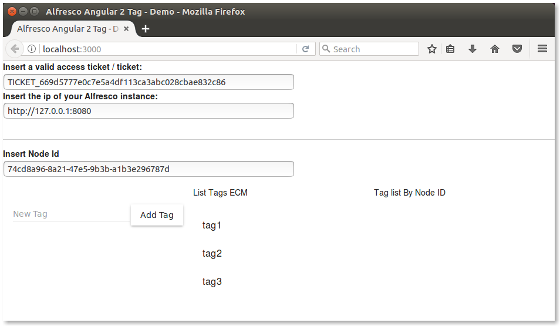

# Content Service Tag demo (ADF 1.6.1 example)

This project is part of the [Alfresco Application Developer Framework](https://github.com/Alfresco/alfresco-ng2-components) collection of examples.
For further details about the repository and all the available examples please check the [introduction](https://github.com/Alfresco/adf-examples).

## About this project

This project implements a tag component from Alfresco Content Services that is requested to be avaialble.

## Prerequisites

Before running the application, please check the assumptions listed below.

- Alfresco Content Services Community Edition 201612 GA release for Linux running on `localhost` on port `8080`. You can check [here](https://community.alfresco.com/docs/DOC-6615-12-installing-alfresco-ecm-as-adf-service-layer) for further details on how to install and setup Alfresco ECM as Alfresco ADF Service Layer.

- [Node.js](https://nodejs.org) JavaScript runtime version 6.9+. Together with its package ecosystem named [npm](https://www.npmjs.com/).

## Running the application

Once the prerequisites will be checked, follow the tasks below to run the application.

- Open a terminal and change the directory to be in the project's folder.

- Install dependencies executing the command below. The execution of this command will require some time to be completed. If some warnings will appear into the terminal, don't worry.

```sh
npm install
```

- Compile and run the application executing the command below. The command compiles and starts the project in watch mode (some errors with description `npm ERR! peer dep missing...` may appear). Upon start, you can navigate to `http://localhost:3000` with your preferred browser. The browser will automatically reload upon changes to the source code.

```sh
npm start
```

## Screenshots

Below some screenshots of the application as an example.



## Feedback, issues or support

For feedback, issues or simply to request support, che the introduction [introduction](https://github.com/Alfresco/adf-examples) for further details.

## Disclaimer

All the content available in this tutorial has been developed and tested using Alfresco ADF v1.3.0 LA release, NodeJs 6.10.0 on a Linux Ubuntu 16.04.01 LTS as Operating System.
Each variation to the listed versions and tools could affect the success of the execution, even if the involved technologies and tasks have been defined to be as more general as possible, not related to any specific context or platform.

## License

Copyright (C) 2017 Alfresco Software Limited

Alfresco Software Limited licenses this file to you under the Apache License, Version 2.0 (the "License"); you may not use this file except in compliance with the License. You may obtain a copy of the License at

 http://www.apache.org/licenses/LICENSE-2.0

Unless required by applicable law or agreed to in writing, software distributed under the License is distributed on an "AS IS" BASIS, WITHOUT WARRANTIES OR CONDITIONS OF ANY KIND, either express or implied. See the License for the specific language governing permissions and limitations under the License.
